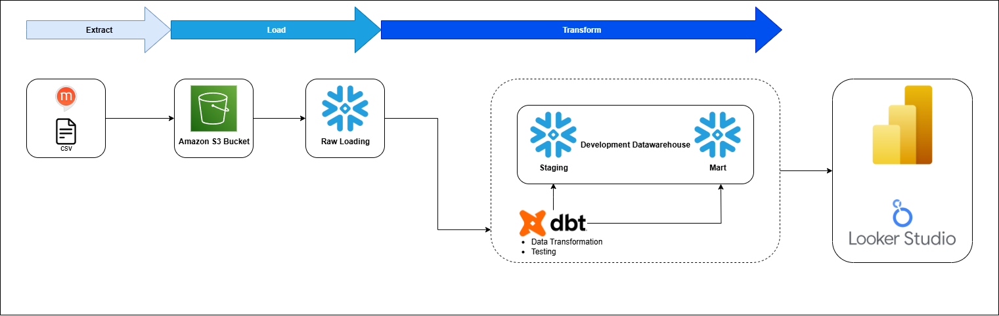
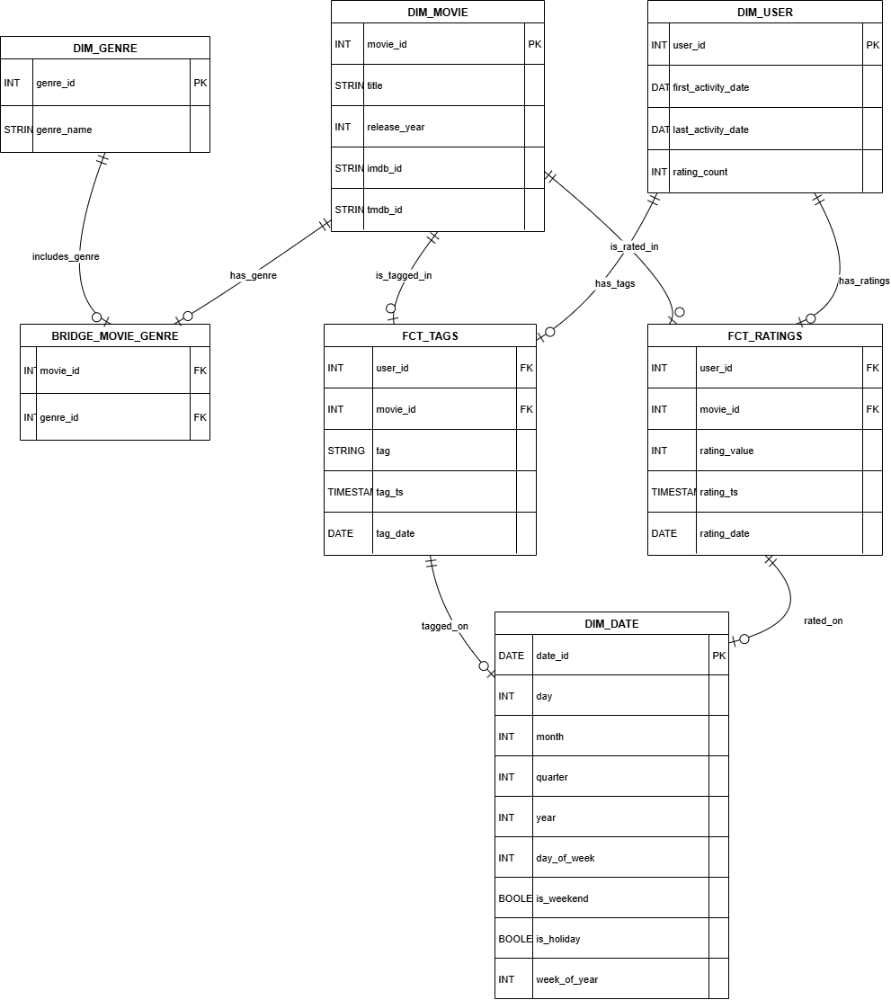
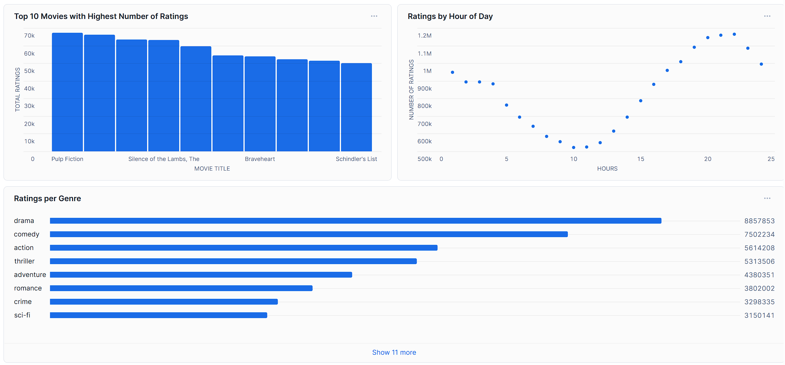

# MovieLens Data Mart Project

## 1. Project Overview

The **MovieLens Data Mart** project aims to build a structured and analytics-ready data environment for movie ratings, tags, and movie metadata. The dataset is sourced from the public **MovieLens 20M dataset**, which contains:

- **20,000,263 ratings** from 138,493 users
- **46,5564 tag applications**
- Metadata for **27,278 movies**
- Data created between **1995-01-09** and **2015-03-31**
- **CSV files** (`ratings.csv`, `tags.csv`, `movies.csv`, `links.csv`) will be **uploaded to an S3 bucket** (simulating a real-world cloud data source).
- Snowflake will connect to the S3 bucket via an **external stage** and load the raw data into the **`RAW` schema**.

The main goal of this project is to transform raw data into a **data mart** suitable for analytical queries, reporting, and visual dashboards.

---

## 2. Objectives

1. **Data Cleaning & Standardization**:
    - Normalize movie titles and extract release years.
    - Split multi-value genres into separate rows for better analysis.
    - Convert timestamps into date and hour components for trend analysis.
2. **Data Structuring**:
    - Organize data into a **galaxy schema** with two fact tables and dimension tables for optimal analytical performance.
3. **Analytical Use Cases**:
    - Identify top-rated movies and most popular genres.
    - Analyze user activity patterns by hour and day.
    - Track trending tags and their relationships with movies and genres.
4. **ELT Automation**:
    - Implement ELT pipelines using **dbt** and **Snowflake** to maintain a clean, up-to-date data mart.
    - Support incremental loads for large datasets (ratings & tags).

---

## 3. Data Pipeline Architecture



## 4. Data Pipeline (ELT) Flow

### 4.1 Raw Layer

- **Schema**: `RAW`
- **Process**:
    1. CSV files uploaded to S3 (`s3://movielens-data/ratings.csv`, etc.).
    2. Snowflake  stage configured to access the S3 bucket.
    3. Data loaded from S3 into **RAW tables** via `COPY INTO RAW.RATINGS_RAW`, `RAW.TAGS_RAW`, etc.

Example Snowflake SQL for loading ratings from S3:

```sql
CREATE OR REPLACE STAGE MOVIELENS_STAGE
  URL='s3://movielens-data'
  CREDENTIALS=(AWS_KEY_ID=' ' AWS_SECRET_KEY=' ');

CREATE OR REPLACE TABLE RAW.RATINGS_RAW (
    userId INTEGER,
    movieId INTEGER,
    rating FLOAT,
    timestamp INTEGER
);

COPY INTO RAW.RATINGS_RAW
FROM @MOVIELENS_STAGE/ratings.csv
FILE_FORMAT = (TYPE = CSV FIELD_OPTIONALLY_ENCLOSED_BY='"' SKIP_HEADER=1)
ON_ERROR = 'CONTINUE';
```

### 4.2 Staging Layer

- **Schema**: `STG`
- **Transformations**:
    - Extract release year from movie titles
    - Standardize genres and explode multi-genre movies
    - Convert timestamps to date (`rating_date`, `tag_date`) and extract hour of day

### 4.3 Data Mart (Galaxy Schema)

- **Schema**: `MART`
- **Schema Design:**



- **Dimensions**:
    - `dim_user`: Users and activity statistics
    - `dim_movie`: Movie details including IMDb and TMDB IDs
    - `dim_genre`: Movie genres
    - `dim_date`: Calendar table to facilitate time-based queries
- **Bridge Table**:
    - `bridge_movie_genre`: Many-to-many relationship between movies and genres
- **Fact Tables**:
    - `fct_ratings`: Stores all ratings with references to `dim_user` and `dim_movie`
    - `fct_tags`: Stores all tag applications with references to `dim_user` and `dim_movie`

### 4.4 Incremental Load

- Ratings and tags are **incrementally loaded** to optimize performance due to large volume of data.
- Fact tables are updated only with new rows from raw CSV sources.

---

## 5. Installation and Set Up

### 5.1 Requirements

- Python 3.12+
- Snowflake account
- AWS account

### 5.2 Download the dataset

- You can download and use the dataset by the following link:
- [https://grouplens.org/datasets/movielens/20m/](https://grouplens.org/datasets/movielens/20m/)

### 5.3 Upload CSVs to S3 Bucket

- Go to S3 and create a bucket
- Upload **CSV files** (`ratings.csv`, `tags.csv`, `movies.csv`, `links.csv`) to the created S3 bucket

### 5.4 Configure Snowflake Stage

```sql
CREATE OR REPLACE STAGE MOVIELENS_STAGE
  URL='s3://movielens-data'
  CREDENTIALS=(AWS_KEY_ID=' ' AWS_SECRET_KEY=' ');
```

### 5.5 Load RAW Data

```sql
COPY INTO RAW.RATINGS_RAW
FROM @MOVIELENS_STAGE/ratings.csv
FILE_FORMAT = (TYPE = CSV FIELD_OPTIONALLY_ENCLOSED_BY='"' SKIP_HEADER=1)
ON_ERROR = 'CONTINUE';
```

- Do the same with `TAGS_RAW`, `MOVIES_RAW`, `LINKS_RAW`.

<aside>

For detailed configure stage and load RAW data please read [/instruction.sql](./instruction.sql)

</aside>

### 5.6 Run dbt models

- In the root directory, create a virtual environment

```bash
virtualenv venv
venv\Scripts\activate
```

- Install dbt-snowflake

```bash
pip install dbt-snowflake
```

- Create dbt profile and initiate dbt project

```bash
mkdir %userprofile%\.dbt
dbt init <projectname>
```

- Configure dbt profile

```bash
movielens:
  target: dev
  outputs:
    dev:
      type: snowflake
      account: "<ACCOUNT>"
      user: "<USER>"
      password: "<PASSWORD>"
      role: "<ROLE>"
      database: "MOVIELENS"
      warehouse: "<WAREHOUSE>"
      schema: "DEV"  # Default schema, dbt_project.yml will override for staging/intermediate
      threads: 4
```

- Run dbt model

```bash
dbt run --select staging
dbt run --select marts
dbt test
```

---

## 6. Example Queries

1. **Ratings by Hour of Day**

```sql
SELECT
    EXTRACT(HOUR FROM rating_ts) AS hour_of_day,
    COUNT(*) AS rating_count
FROM fct_ratings
GROUP BY hour_of_day
ORDER BY hour_of_day;
```

1. **Top 10 Rated Movies**

```sql
SELECT
    m.title,
    COUNT(r.rating_value) AS total_ratings,
    AVG(r.rating_value) AS avg_rating
FROM fct_ratings r
JOIN dim_movie m ON r.movie_id = m.movie_id
GROUP BY m.title
ORDER BY total_ratings DESC
LIMIT 10;
```

1. **Ratings per Genre**

```sql
SELECT
    g.genre_name,
    COUNT(r.rating_value) AS total_ratings,
    AVG(r.rating_value) AS avg_rating
FROM fct_ratings r
JOIN bridge_movie_genre bmg ON r.movie_id = bmg.movie_id
JOIN dim_genre g ON bmg.genre_id = g.genre_id
GROUP BY g.genre_name
ORDER BY total_ratings DESC;
```

1. **Dashboard**
- Base on the queries, we can create some visualization on Snowflake:



---

## 7. Dashboard Ideas

1. **Ratings Overview**
    - Number of ratings by hour/day/week
    - Top-rated movies and most active users
2. **Movies & Genres**
    - Distribution of movies by genre and release year
    - Top genres by average rating
3. **Tag Trends**
    - Most popular tags over time
    - Tag distribution across genres
4. **User Engagement**
    - User activity patterns
    - Ratings per user distribution

---

## 8. Testing & Data Validation

- **Schema Tests**: Ensure uniqueness and non-null for primary keys in dimension tables.
- **Fact Table Tests**: Validate relationships between facts and dimensions.
- **Date Dimension**: Validate that all dates exist in `dim_date` and correspond to ratings/tags.

---

## 9. Conclusion

The **MovieLens Data Mart** integrates raw CSVs from S3 into Snowflake, structures them into a **galaxy schema**, and supports advanced analytics on ratings, movies, and tags.

- ELT is automated via dbt.
- The data mart supports **incremental loads**, **time-series analysis**, and **dashboarding**.
- Analysts can easily explore movie popularity, user behavior, and tag trends.